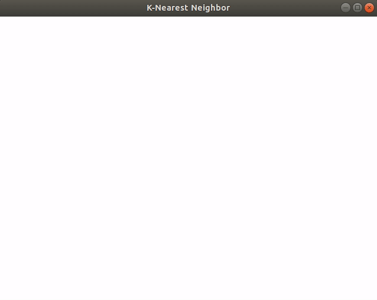
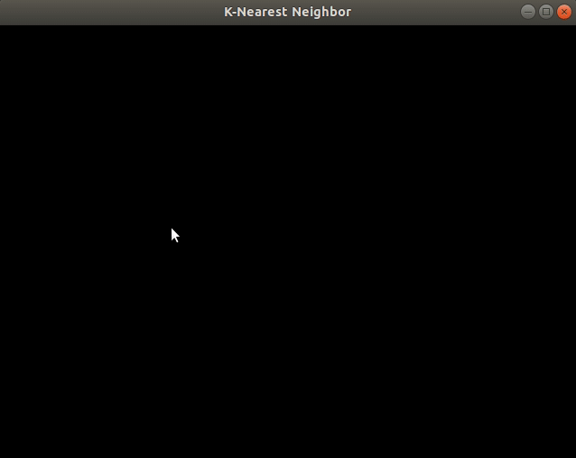

# Machine Learning Algorithm Visualised

Using C language with OpenGL

To compile and run any algorithm use following compand
 >gcc file_name.c -lglut -lGL -lGLEW -lGLU -lm -o output_file_name
 >./output_file_name

To install OpenGL on Linux(Ubuntu), Run Following Commands
 >sudo apt-get update

 >sudo apt-get install freeglut3

 >sudo apt-get install freeglut3-dev

 >sudo apt-get install binutils-gold

 >sudo apt-get install g++ cmake

 >sudo apt-get install libglew-dev

 >sudo apt-get install g++

 >sudo apt-get install mesa-common-dev

 >sudo apt-get install build-essential

 >sudo apt-get install libglew1.5-dev libglm-dev 

Following Algorithms are Implemented:
 * K-Nearest Neighbors
 * Linear Regression with and without Gradient Descent
 * K-means Clustering

## K-Nearest Neighbors
It is Classification Algorithm.
The Implemented Algorithm can able to classify an object class from upto 5 different classes specified by different color such Red, Blue, Green, Orange and Yellow.

Press following keybord keys to enter a object on possition of mouse pointer:
1. For Red press **r**
2. For Blue press **b**
3. For Green press **g**
4. For Orange press **o**    
5. For Yellow press **y**

The Test Object is Specified by Black Color.

Press **t** on keybord to enter test object on possition of mouse pointer

Press **Enter** on keyboard to run the algorithm 

The Color of test object will automatically change to the classified class color. There is also added funtioanlity for reloading, loading and new.

Press following keybord keys:
1. For Reloading press **R**

    This will reset the window by removing test point but keeping all the points
2. For Loading press **L**

    This will reset the window by keeping all the points and also keeping the classifeid test point
3. For New press **N**

    This will reset the window by removing all the points

## Linear Regression with and without Gradient Descent
Linear Regression is a prediction algorithm and Gradient Descent is optimization fuction which is used to minimize error in prediction.

Press following keybord keys to enter a point on possition of mouse pointer:
1. For point press **t**
2. For prediction point press **b**

Press **Enter** on keyboard to run the algorithm

## K-means Clustering
It is a clustering algorithm that used to find groups in the data